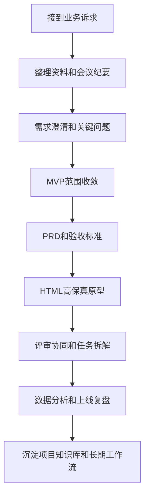
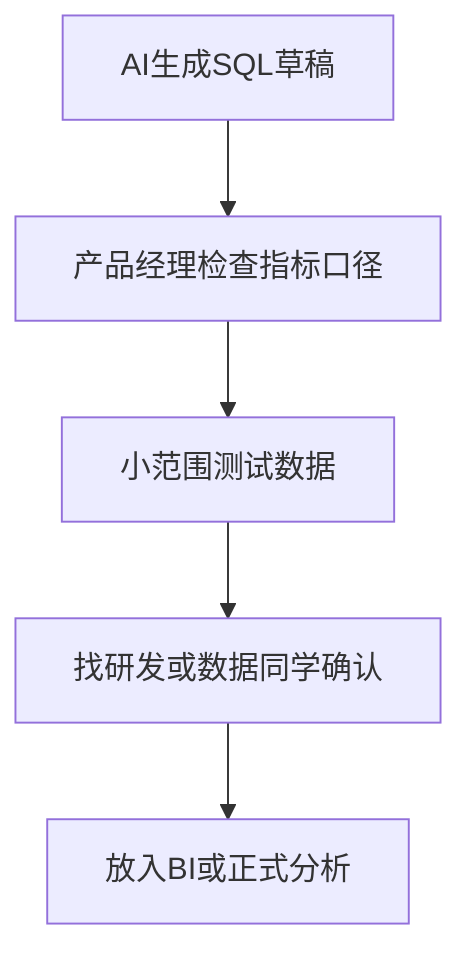
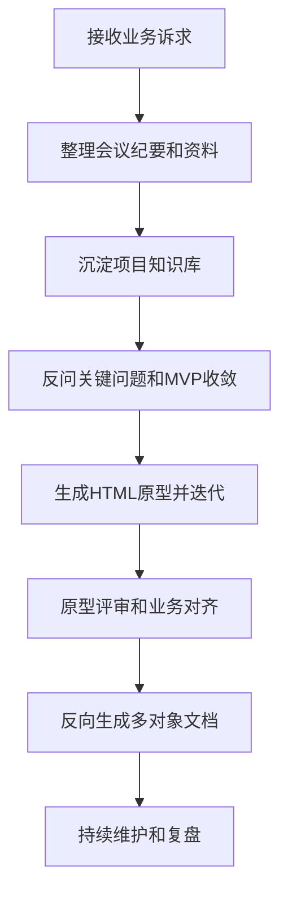

# PM 岗位 AI 应用实战分享

> 公司内部培训课件 · v6.7  
> 时长：约 120 min  
> 主题：产品经理如何用 AI 工具提升需求分析、文档产出、原型设计、数据分析和协同效率  
> 定位：这不是 AI 工具测评，也不是标准答案输出，而是一次面向产品经理日常工作的 AI 应用交流分享。  
> GitHub Pages（预览阅读）：[PM AI Toolkit](https://xuqiang97.github.io/pm-ai-toolkit/#/)  
> GitHub 仓库（查看原文）：[xuqiang97/pm-ai-toolkit](https://github.com/xuqiang97/pm-ai-toolkit)（复制 Prompt / 查看 Mermaid 更方便）

---

## 一、课程信息

| 项 | 内容 |
|---|---|
| 课程名称 | **PM 岗位 AI 应用实战分享：从模糊需求到可交付方案** |
| 课程时长 | 约 120 min / 2 小时 |
| 课程对象 | 公司内部产品经理 / 产品助理 / 需要参与需求设计和项目推进的同事 |
| 课程定位 | 交流分享为主，少讲概念，多看产品经理日常工作中可参考的 AI 工作流 |
| 课程目标 | 听完后能选择 2-3 个真实工作场景尝试用起来 |
| 课后产出 | 常用 Prompt 模板、AI 工作流清单、案例参考 |

---

## 二、这堂课主要解决什么问题

产品经理日常工作里，经常会遇到这些场景：

1. 业务方只给一句模糊诉求，需要先把问题问清楚。
2. 会议纪要、聊天记录、业务反馈散落在各处，整理成本较高。
3. PRD、验收标准、异常场景容易写得不完整。
4. 页面需求只靠文字表达，业务方和研发容易理解不一致。
5. 一期范围容易越做越大，需要有意识地收敛 MVP。
6. 需求变更、数据分析、项目复盘等工作，经常需要更多结构化辅助。

本次分享不追求覆盖所有 AI 工具，也不提供所谓标准答案，只是结合个人实践，抛砖引玉地演示一条相对实用的工作路径：

> **产品经理如何借助 AI，把一个模糊业务问题，逐步整理成可讨论、可评审、可开发、可复盘的产品方案。**

---

## 三、课程主线



一句话概括：

> **AI 不是替代产品经理做判断，而是帮助产品经理更有条理地完成结构化分析、表达和交付。**

---

## 四、整体课程安排

| 时间 | 模块 | 重点内容 |
|---:|---|---|
| 0–10 min | 开场：PM 为什么要用 AI | 分享背景、使用边界、2 小时主线说明 |
| 10–25 min | 工作流一：接需求与资料整理 | 会议听记、多源文本转 MD、项目知识库 |
| 25–45 min | 工作流二：需求澄清与范围收敛 | AI 反问关键问题、完整度评分、MVP 范围收敛、现场演示 |
| 45–65 min | 工作流三：PRD 与评审准备 | PRD 草稿、反向检查、验收用例、评审材料 |
| 65–90 min | 工作流四：HTML 高保真原型 | 生成可点击原型、连续迭代、模拟用户预审、多对象文档 |
| 90–102 min | 工作流五：协同交付与上线 | 变更影响分析、研发任务拆解、测试清单、上线通知 |
| 102–108 min | 工作流六：数据分析与复盘 | CSV / Excel 分析、SQL 辅助、异常洞察、项目复盘 |
| 108–118 min | 真实案例串讲 | AI 商品视频系统从需求到原型到文档 |
| 118–120 min | 进阶展望与收尾 | Projects、Canvas、MCP、Codex / Claude Code、课后参考资料 |

> 2 小时版本会增加现场讲解、演示和案例拆解时间，但仍然围绕主线展开：需求澄清、MVP 收敛、PRD 检查、HTML 原型、变更影响分析和真实案例。其他内容作为课后资料。

---

## 现场讲解说明

这份 README 整体同时承担两个用途：**2 小时交流分享主线 + 课后 Prompt 资料库**。

现场会按 Tip 1-30 的顺序走完整工作流，但不会逐条展开。标注“现场重点”的 Tip 会重点讲解，标注“简短演示”的 Tip 会做快速展示，其余 Tip 作为资料库带过，方便大家课后按需查阅。

> 讲者提示：现场可以从文档顶部顺序讲到 **Part 4：课程总结**。到 Part 4 结束时，现场分享主线已经闭环；后面的 Prompt 清单和附录主要是课后资料，不需要现场逐条讲。

### 开场提示

现场开场不用把所有章节都解释完，先讲清楚三件事即可：

1. 这不是工具测评，也不是标准答案，只是一次工作方法交流。
2. 现场重点看一条链路：模糊需求如何逐步变成原型、文档和交付材料。
3. Prompt 不需要现场记住，课后可以回到 README 里按场景复制和改写。

### 现场记忆点

1. 先问清：不要急着写方案，先让 AI 反问关键问题。
2. 再收敛：把一期范围砍到能闭环、能落地。
3. 再原型：用 HTML 原型把抽象需求变成可讨论的界面。
4. 再评审：让 AI 帮忙补边界、扫风险。
5. 再复盘：把项目过程、数据和经验沉淀下来。

### 现场讲解节奏

| 工作流 | 覆盖 Tip | 现场处理方式 |
|---|---:|---|
| 接需求与资料整理 | Tip 1-4 | 顺序带过，说明资料整理的重要性 |
| 需求澄清与范围收敛 | Tip 5-8 | 重点讲 Tip 5、6、7，Tip 8 作为补充 |
| PRD 与评审准备 | Tip 9-13 | 重点讲 Tip 9、11，其余作为课后参考 |
| HTML 高保真原型 | Tip 14-21 | 重点讲 Tip 14，其他作为原型后续延展 |
| 协同交付与上线 | Tip 22-26 | 重点讲 Tip 22，其余作为交付资料库 |
| 数据分析与复盘 | Tip 27-30 | 简短演示 Tip 27、28，复盘部分带过 |
| 课后资料 | Part 5 Prompt 清单、附录 D 30 个 Tip 总览 | 作为课后参考和查阅资料 |

### 现场演示清单

| 演示 | 对应内容 | 现场目标 |
|---|---|---|
| 演示 1 | Tip 5-7：反问关键问题、完整度评分、MVP 收敛 | 让大家看到 AI 如何帮助需求澄清 |
| 演示 2 | Tip 14：HTML 高保真原型 | 让大家看到抽象需求如何变成可讨论界面 |
| 演示 3 | Tip 22：需求变更影响分析 | 让大家看到“小改动”背后的影响面 |
| 选讲演示 | Tip 27 / Tip 28：数据分析与 SQL | 如果时间允许，展示 AI 辅助看数和写 SQL 的边界 |

### 课后参考路径

如果后续想在自己的工作里尝试，可以先按这个顺序从小场景开始：  
第 1 步：用 Tip 5 尝试“AI 反问关键问题”。  
第 2 步：用 Tip 7 尝试“MVP 范围收敛”。  
第 3 步：用 Tip 9 / Tip 11 尝试“PRD 草稿 + 反向检查”。  
第 4 步：用 Tip 14 尝试“HTML 高保真原型”。  
第 5 步：用 Tip 22 尝试“需求变更影响分析”。

---

## 五、工具使用原则

### 1. 不迷信单一工具，按场景选择

AI 工具很多，不需要一开始全部掌握。

建议大家先记住一个原则：

> **先用一个主工具跑通自己的高频工作流，再逐步补充其他工具。**

本次演示会涉及 ChatGPT、Claude、Gemini、NotebookLM、钉钉 AI 听记、GitHub Pages 等工具，但重点不是工具本身，而是背后的工作方法。

### 2. 工具分层建议

| 层级 | 工具 | 适合场景 |
|---|---|---|
| 建议先学 | ChatGPT / Claude / Gemini 任选其一 | 需求拆解、文档生成、原型设计、数据分析 |
| 推荐掌握 | Projects / NotebookLM | 长期项目、长文档、知识库问答 |
| 场景工具 | 钉钉 AI 听记 | 会议纪要、语音转文字 |
| 进阶工具 | GitHub Pages / Canvas / Codex / Claude Code / MCP | 原型发布、文档协作、项目级自动化 |

### 3. 工具策略

| 场景 | 推荐工具 | 说明 |
|---|---|---|
| 需求拆解 / 文档生成 | ChatGPT / Claude / Gemini | 都可以，重点是 Prompt 和上下文 |
| HTML 页面原型 | ChatGPT / Claude / Gemini | Claude 和 GPT 都比较适合，按个人使用习惯选择 |
| 联网调研 | ChatGPT / Gemini | 适合查行业资料、竞品信息、工具动态 |
| 生图配图 | ChatGPT / Gemini | 适合汇报页头图、概念图、视觉化插图 |
| 多文档知识库 | NotebookLM / Projects | 适合项目资料沉淀和长期问答 |
| 原型在线分享 | GitHub Pages | 适合把 HTML 原型发链接给业务方或研发 |

### 4. 关键提醒

> **工具会变，工作流不变。**

真正重要的是掌握产品经理的 AI 工作流：

```text
业务输入 → 需求澄清 → 范围取舍 → 原型表达 → 评审协同 → 数据复盘 → 项目沉淀
```

---

## 六、AI 使用安全边界

公司内部使用 AI 工具时，需要注意以下几点：

1. 不上传账号、密码、AppKey、AppSecret、Token 等密钥信息。
2. 不上传客户隐私、供应商敏感信息、合同金额等敏感数据。
3. 不上传未经脱敏的业务核心数据。
4. 涉及真实业务数据时，先做脱敏或只给字段结构和样例。
5. AI 生成内容必须由产品经理审核后再使用。
6. AI 输出的 SQL、接口方案、权限逻辑不能直接照搬，需要研发和产品共同确认。
7. 涉及公司内部系统截图时，注意遮挡敏感信息。
8. 对外发布材料前，需要检查是否包含内部系统名称、真实账号、真实客户、真实金额等信息。

使用提醒：

> **可以把 AI 当成高效助理，但最终判断和责任仍然在产品经理。**

---

# Part 1：PM 用 AI 干活的常用工作流

> 讲者提示：从这里开始按工作流顺序讲，不需要回到前面的节奏表。每个工作流先讲目标和现场讲法，再顺着 Tip 编号往下走。

---

## 工作流一：接需求与资料整理

> 目标：把零散、口语化、不完整的业务信息，快速整理成结构化材料。
> 听众带走：先把输入材料整理成 AI 能理解的上下文，后面的输出才更稳定。
> 现场讲法：这一节按 Tip 1-4 顺序带过，重点说明“先把输入材料整理好，后面的 AI 输出才更稳定”。
> 演示提示：如需演示，只展示一段会议纪要 / 聊天记录如何整理成 Markdown，不需要展开知识库细节。

---

### Tip 1：会议沟通直接用 AI 听记

#### 适用场景

1. 业务方异地沟通。
2. 电话或线上会议讨论需求。
3. 项目评审、方案讨论、问题复盘。
4. 没法边听边完整记录。

#### 推荐做法

使用钉钉 AI 听记或其他语音转文字工具，把会议内容先完整转成文本。

#### 产品经理收益

1. 会上可以专心理解，不用一直低头记笔记。
2. 会后有原始文字稿，可以回溯业务方原话。
3. 后续可以把文字稿继续交给 AI 整理成需求材料。
4. 避免“我记得他说过”和“业务方不认”的沟通问题。

---

### Tip 2：多源文本统一转成 MD

#### 适用场景

产品经理经常会拿到各种格式的材料：钉钉听记文字稿、业务方聊天记录、飞书 / 钉钉文档、邮件、截图 OCR、Excel 表格备注、历史 PRD 片段。

#### Prompt 模板

```text
请把以下原始文本统一整理成结构化 Markdown 文档。

要求：
1. 用 H2 / H3 区分主题层级。
2. 去掉口水话和明显重复内容，但保留原意。
3. 不要新增原文没有的信息。
4. 不确定的地方用 [TBD] 标注。
5. 把业务诉求、问题反馈、功能要求、待确认事项分开整理。
6. 最后输出一份“待确认问题清单”。

原始文本如下：

[粘贴会议纪要 / 聊天记录 / 业务反馈]
```

#### 输出示例结构

```markdown
## 业务背景

## 当前问题

## 业务诉求

## 功能要求

## 约束条件

## 待确认问题

## 后续建议
```

#### 关键价值

> 先把信息变成结构化材料，后面写 PRD、画流程、做原型都会更顺。

---

### Tip 3：会后纪要升级成“决策记录”

#### 背景

普通会议纪要只是记录谁说了什么。产品经理真正需要的是：确认了什么、否决了什么、谁负责什么、哪些问题没解决、哪些决策以后不能反复推翻。

#### Prompt 模板

```text
请把以下会议记录整理成产品评审会纪要。

请重点输出：
1. 会议结论。
2. 已确认的产品决策。
3. 被否决的方案及原因。
4. 待确认问题。
5. 各方分工。
6. 风险点。
7. 下一步行动计划。
8. 决策记录表。

决策记录表格式：
| 编号 | 决策事项 | 最终结论 | 决策原因 | 影响范围 | 后续是否可变更 |

要求：
1. 不要写流水账。
2. 不要记录无关闲聊。
3. 不确定的地方标注 [TBD]。
4. 所有行动项要有负责人和截止时间，如果原文没有则标注待补充。

会议记录如下：

[粘贴会议记录]
```

#### 关键价值

> PM 不只是记录会议，更要沉淀决策。

---

### Tip 4：把项目资料沉淀到知识库

#### 适用场景

一个项目做久了之后，资料会越来越多：需求会议纪要、业务方反馈、PRD、原型说明、技术方案、接口文档、测试问题、上线复盘。

三个月后再问“当初为什么这么设计”，经常要翻半天。

#### 推荐做法

把项目资料整理成 MD 后，放进项目知识库。

| 工具 | 适合场景 |
|---|---|
| ChatGPT Projects | 适合长期项目、持续对话、文档和上下文沉淀 |
| Claude Projects | 适合长文档协作、项目风格固化、多轮迭代 |
| NotebookLM | 适合多文档调研、资料问答、从大量文档中快速找答案 |

#### 可以问知识库的问题

```text
这个项目最初的业务目标是什么？
```

```text
当时为什么决定一期不做这个功能？
```

```text
请总结这个项目目前所有待确认事项。
```

```text
请根据现有资料，帮我整理一份给研发看的开发注意事项。
```

---

## 工作流二：需求澄清与范围收敛

> 目标：让 AI 帮助 PM 把需求问清楚、想完整、砍到能落地。
> 听众带走：遇到模糊需求时，不急着写方案，先反问、评分、收敛范围。
> 现场讲法：这是第一段重点。按 Tip 5 → Tip 6 → Tip 7 展开讲，Tip 8 作为补充带过。
> 演示提示：建议用同一个模糊需求连续演示：先让 AI 反问关键问题，再做完整度评分，最后做 MVP 范围收敛。

---

### Tip 5：让 AI 先反问关键问题，而不是直接写方案（现场重点）

#### 背景

一个常见误区是：一上来就让 AI 直接写 PRD、画原型或写方案。这容易导致 AI 脑补。

更稳妥的做法是：**先让 AI 反问你关键问题。**

#### Prompt 模板

```text
你是一位资深产品经理。

我接下来会给你一个比较模糊的业务需求。
请你不要急着写方案，而是先反向问我 10 个关键问题。

要求：
1. 问题要覆盖业务目标、用户角色、使用场景、流程边界、权限、数据、异常、指标、一期范围、二期扩展。
2. 每个问题后面说明：为什么这个问题重要。
3. 按优先级排序。
4. 最后告诉我：如果这些问题不确认，PRD 里最容易出什么风险。

业务需求如下：

[粘贴需求]
```

#### 示例需求

```text
我们想做一个多人查看已完成 AI 生图任务的页面。
```

AI 可能会反问：普通员工、小组长、高级主管、管理员分别能看哪些数据？任务归属按创建人、执行人还是所属团队判断？任务视图和图片视图分别解决什么问题？是否支持跨团队查看？美工版和运营版是否共用一套权限规则？

#### 这个做法的价值

这个技巧可以让产品经理从“让 AI 代写”升级为“让 AI 辅助需求澄清”。

---

### Tip 6：需求信息完整度评分（现场重点）

#### Prompt 模板

```text
你是一位资深产品经理。

请评估下面这份需求材料的信息完整度。

请按 100 分制打分，并分别从以下维度评分：
1. 业务背景是否清晰。
2. 目标用户是否清晰。
3. 核心目标是否清晰。
4. 功能范围是否清晰。
5. 不做范围是否清晰。
6. 主流程是否清晰。
7. 异常流程是否清晰。
8. 权限规则是否清晰。
9. 数据指标是否清晰。
10. 依赖和风险是否清晰。

请输出：
1. 总分。
2. 每个维度的得分。
3. 缺失信息清单。
4. 最影响后续开发的 5 个缺口。
5. 建议我下一步优先找业务方确认的问题。

需求材料如下：

[粘贴需求材料]
```

#### 价值

它可以帮 PM 快速判断这个需求能不能进入 PRD、能不能评审、哪些问题必须先确认、哪些内容可以先标 TBD、哪些内容是上线风险。

---

### Tip 7：MVP 范围收敛（现场重点）

#### 背景

AI 不只是帮我们补内容，也可以帮助我们梳理取舍。这里的重点不是让 AI 替我们决定，而是提供一个讨论框架。

#### Prompt 模板

```text
你是一位非常务实的 B 端产品负责人。

请基于下面这份需求，帮我做 MVP 范围收敛。

请输出：
1. 必须做：没有它就无法闭环。
2. 应该做：影响体验，但可以简化。
3. 可以不做：一期可以砍掉。
4. 明确不做：容易过度设计，建议二期再看。
5. 每个被砍功能的理由。
6. 被砍后的一期兜底方案。
7. 二期再补时的触发条件。

要求：
1. 优先保证一期快速上线和业务闭环。
2. 不要为了完整而完整。
3. 每个建议都要说明取舍理由。
4. 站在产品、研发、业务三方平衡角度判断。

需求如下：

[粘贴需求]
```

#### 输出建议格式

```markdown
| 功能点 | 一期建议 | 原因 | 兜底方案 | 二期触发条件 |
|---|---|---|---|---|
| 批量导出 | 可以不做 | 一期先验证查询和查看价值，导出可能带来权限与性能风险 | 管理员临时数据库导出 | 业务每周导出需求超过 3 次 |
```

---

### Tip 8：一句话需求转完整需求分析框架

#### Prompt 模板

```text
你是一位资深产品经理。

请基于以下业务诉求，帮我拆解成需求分析框架。

业务诉求：
[粘贴业务方原始描述]

请输出：
1. 业务背景。
2. 当前痛点。
3. 目标用户。
4. 业务目标。
5. MVP 范围。
6. 不做范围。
7. 核心流程。
8. 异常场景。
9. 权限规则。
10. 数据指标。
11. 待确认问题。
12. 二期扩展建议。

要求：
1. 不要空泛。
2. 不要过度设计。
3. 一期优先可落地。
4. 不确定的地方标注 [TBD]。
```

---

## 工作流三：PRD 与评审准备

> 目标：让 AI 辅助产品经理把 PRD 写得更有结构，但最终判断仍由产品经理负责。
> 听众带走：AI 可以先起草，但还要反向检查，最终判断仍然在产品经理手里。
> 现场讲法：重点讲 Tip 9 和 Tip 11，说明“先生成草稿，再反向检查”。Tip 10、12、13 作为 PRD 后续延展带过。
> 演示提示：可以沿用前面整理出的需求材料，现场生成一段 PRD 草稿，再让 AI 检查问题和边界。

---

### Tip 9：零散需求生成 PRD 草稿（现场重点）

#### Prompt 模板

```text
你是一位资深 B 端产品经理。

请基于以下需求材料，帮我写一份 PRD 草稿。

需求材料：
[粘贴整理后的需求 MD]

请包含：
1. 需求背景
2. 需求目标
3. 目标用户
4. 使用场景
5. 功能范围
6. 不做范围
7. 主流程
8. 异常流程
9. 字段说明
10. 权限规则
11. 验收标准
12. 风险与依赖
13. 待确认问题

要求：
1. 不要编造材料里没有的信息。
2. 不确定的地方标注 [TBD]。
3. 不要过度设计，优先保证 MVP 可落地。
4. 表达要适合研发、测试、业务方共同评审。
```

#### 使用建议

AI 生成的 PRD 草稿不要直接发出去。产品经理需要重点检查：是否符合真实业务目标、是否有过度设计、权限和数据边界是否正确、异常场景是否完整、验收标准是否可测试、是否有 AI 自己脑补的内容。

---

### Tip 10：few-shot 让 AI 学你的写作风格

#### Prompt 模板

```text
我接下来会给你 3 份我之前写过的 PRD。

请你仔细学习这些 PRD 的：
1. 信息组织方式。
2. 章节结构。
3. 详略取舍。
4. 用词风格。
5. 句式习惯。
6. 验收标准写法。
7. 风险和边界的表达方式。

学完后，我会给你一个新需求。
请你按照尽可能接近我原有风格的方式，帮我写一份新 PRD。

样本 1：
[粘贴]

样本 2：
[粘贴]

样本 3：
[粘贴]
```

#### 进阶用法

把这套风格要求沉淀到 Projects 里，后续同一个项目中让 AI 默认按你的风格输出。

---

### Tip 11：让 AI 反向检查你的 PRD（现场重点）

#### Prompt 模板

```text
你是一位有经验且审慎的资深产品经理。

请对以下 PRD 提出至少 10 个潜在问题，重点检查：

1. 业务逻辑漏洞。
2. 用户体验边界情况。
3. 异常处理是否完备。
4. 权限和数据范围是否清晰。
5. 技术实现是否可能存在风险。
6. 跟现有系统是否可能冲突。
7. 验收标准是否可测试。
8. 是否存在过度设计。
9. 是否存在一期范围过大。
10. 是否有关键待确认问题没有暴露出来。

要求：
1. 先直接指出问题，再给修改建议。
2. 按严重程度排序。
3. 每个问题都要说明为什么重要。
4. 能给修改建议的，请直接给建议。

PRD 内容如下：

[粘贴 PRD]
```

---

### Tip 12：自动生成验收用例

#### Prompt 模板

```text
基于以下 PRD，帮我生成完整的验收用例清单。

要求：
1. 每个功能点至少 3 条用例：正常场景 / 异常场景 / 边界条件。
2. 用例格式为：[编号] [前置条件] [操作步骤] [预期结果]。
3. 重点输出容易被漏掉的边界条件。
4. 单独列出一份“高风险用例清单”。
5. 如果 PRD 中有描述不清的地方，请先列为待确认问题。

PRD 内容如下：

[粘贴 PRD]
```

#### 示例输出格式

```markdown
| 编号 | 功能点 | 前置条件 | 操作步骤 | 预期结果 | 场景类型 |
|---|---|---|---|---|---|
| TC001 | 新增配置 | 用户有管理员权限 | 点击新增，填写完整字段并保存 | 保存成功，列表出现新记录 | 正常 |
| TC002 | 新增配置 | 用户有管理员权限 | 必填字段为空时保存 | 页面提示必填项不能为空 | 异常 |
| TC003 | 新增配置 | 用户有管理员权限 | quota JSON 格式错误时保存 | 页面提示 JSON 格式错误 | 边界 |
```

---

### Tip 13：生成需求评审会材料

#### Prompt 模板

```text
你是一位资深产品经理。

请基于以下 PRD，帮我生成一份需求评审会材料。

请包含：
1. 本次评审目标。
2. 需求背景。
3. 本期范围。
4. 不做范围。
5. 核心流程。
6. 页面或功能清单。
7. 重点规则。
8. 权限说明。
9. 异常场景。
10. 需要重点评审的问题。
11. 需要业务方确认的问题。
12. 需要研发评估的问题。
13. 需要测试关注的问题。
14. 会后待办清单模板。

要求：
1. 适合直接放到会议文档。
2. 重点突出，不要照搬完整 PRD。
3. 评审问题要具体。
4. 让参会人知道自己需要看什么、确认什么。

PRD 如下：

[粘贴 PRD]
```

---

## 工作流四：HTML 高保真原型

> 目标：把抽象需求快速变成可点击、可讨论、可评审的界面。
> 听众带走：页面型需求可以先做可点击原型，让讨论从文字想象变成界面共识。
> 现场讲法：这是第二段重点。Tip 14 展开讲，Tip 15-21 按“迭代、反推文档、预审、发布”顺序带过。
> 演示提示：这里最适合现场实操。建议用 Tip 14 的 Prompt 生成或展示一个 HTML 原型；如果网络或模型不稳定，就展示提前准备好的结果。

这是本次分享里比较值得现场看的部分。

---

### Tip 14：用 AI 生成 HTML 高保真原型（现场重点）

#### 为什么这一步很重要

传统页面需求经常是：

```text
PRD 文档 → 简单线框图 → 业务方想象 → 研发实现 → 上线后发现理解不一致
```

AI 生成 HTML 原型后，可以变成：

```text
业务诉求 → AI 生成可点击原型 → 业务方/研发直接看界面 → 评审前快速迭代 → 再补 PRD 和开发说明
```

#### 注意

这里不是说不要 PRD，而是：

> 对于强页面交互类需求，可以先用 AI 快速生成 HTML 原型，把抽象需求变成可点击、可讨论的界面，再反向补齐 PRD、技术说明和验收标准。

#### Prompt 模板

```text
你是一位资深 B 端产品设计师和前端工程师。

我要做一个 [功能名称] 的 HTML 高保真原型。

目标用户：
[填写用户角色，例如：运营、产品经理、管理员、客服等]

业务背景：
[简单说明业务背景]

需求要点：
1. [功能点 1]
2. [功能点 2]
3. [功能点 3]
4. [功能点 4]

页面要求：
1. 使用 HTML 单文件，包含 CSS 和必要的 JavaScript。
2. 直接在浏览器打开即可运行。
3. 风格为企业后台系统，简洁、专业、信息层级清晰。
4. 使用 mock 数据，不需要真实后端接口。
5. 关键交互要能点击，例如新增、编辑、查看、筛选、分页、弹窗或抽屉。
6. 页面要适合电脑端使用。
7. 中文文案要自然，适合真实业务系统。

请直接输出完整 HTML 代码，不要解释。
```

#### 适合生成的页面类型

后台管理列表页、配置页面、任务创建向导、详情页、审核工作台、数据看板、权限管理页面、操作日志页面。

---

### Tip 15：用“连续追问”快速迭代原型

AI 第一次生成的原型通常不会完全符合预期。不要指望一次生成完美，而是把它当成一个前端设计搭子，连续迭代。

#### 常见迭代指令

```text
整体方向对，但页面太花了，请改成更克制的企业后台风格。
```

```text
查询区太高了，压缩高度，列表区域要展示更多数据。
```

```text
quota 字段内容比较长，请把这一列加宽，并用代码块样式展示 JSON。
```

```text
新增和编辑不要用弹窗，改成右侧抽屉。
```

```text
这个页面要给运营用，文案不要太技术化，请改得更业务化。
```

```text
请保留现有布局，不要大改，只优化表格行高和操作按钮位置。
```

#### 关键技巧

每轮只改 2-3 个明确问题；说清楚“哪些地方不要动”；对满意的部分要明确保留；对不满意的部分要具体描述。

---

### Tip 16：截图反推需求说明

#### Prompt 模板

```text
你是一位资深 B 端产品经理。

请基于这张页面截图，帮我反向整理产品需求说明。

请输出：
1. 页面名称。
2. 页面目标。
3. 目标用户。
4. 页面模块拆解。
5. 查询条件。
6. 列表字段。
7. 操作按钮。
8. 弹窗 / 抽屉 / 跳转逻辑。
9. 可能的接口。
10. 字段规则。
11. 异常场景。
12. 可以优化的地方。

要求：
1. 不确定的地方标注 [推测]。
2. 不要把推测当事实。
3. 适合产品经理继续改成 PRD。

截图如下：

[上传截图]
```

#### 价值

这招非常适合新人 PM。因为很多新人看到页面不知道怎么拆，AI 可以帮他建立“页面结构化分析能力”。

---

### Tip 17：HTML 原型反向生成多对象文档

#### 场景

HTML 原型定稿后，不同角色需要看的文档不一样。

| 对象 | 需要的内容 |
|---|---|
| 业务方 | 这个功能解决什么问题，怎么用，有什么价值 |
| 研发 | 页面结构、字段、接口、状态、异常逻辑 |
| 测试 | 功能点、验收标准、异常场景 |
| 老板 | 背景、目标、价值、收益、风险 |
| 运营用户 | 操作步骤、注意事项、常见问题 |

#### 给研发的 Prompt

```text
基于以下 HTML 原型，生成一份给研发同学看的技术要点说明。

请包含：
1. 页面功能概述。
2. 页面模块拆解。
3. 字段清单，包括字段名、含义、类型、是否必填、展示规则。
4. 可能需要的接口清单，包括接口用途、入参、出参。
5. 关键交互说明。
6. 状态流转说明。
7. 异常场景和提示文案。
8. 权限控制建议。
9. 开发注意事项。
10. 待产品确认问题。

要求：
1. 表达简洁、清晰、可执行。
2. 不要写空泛内容。
3. 不确定的地方标注 [TBD]。
4. 适合研发直接据此拆任务。

HTML 原型如下：

[粘贴 HTML 代码]
```

#### 给老板的一页纸 Prompt

```text
基于以下 HTML 原型，生成一份给老板看的 1 页项目说明。

请包含：
1. 一句话说明这是什么功能。
2. 当前业务痛点。
3. 这个功能如何解决问题。
4. 关键设计点，最多 3 条。
5. 预期收益，尽量可量化。
6. 当前风险和需要支持的事项。

要求：
1. 500 字以内。
2. 不讲技术细节。
3. 表达要偏业务价值。
4. 让老板 1 分钟内能看懂。

HTML 原型如下：

[粘贴 HTML 代码或截图描述]
```

#### 关键价值

> 一份 HTML 原型，可以反向生成多份面向不同对象的文档。

---

### Tip 18：让 AI 模拟用户做可用性预审

#### Prompt 模板

```text
你现在不是 AI 助手，而是一个真实用户。

请按下面画像扮演：

姓名：[用户姓名]
岗位：[岗位，例如运营、客服、仓储、财务]
工作背景：[他的日常工作内容]
使用习惯：[例如习惯 Excel、不喜欢复杂系统、时间紧张等]
当前情绪：[例如很忙、刚被催、希望快速完成任务]

接下来我会给你一个产品原型。

请你以这个用户的身份完成以下任务：
1. 描述打开页面第一眼看到什么。
2. 说出你第一步想做什么。
3. 按核心流程走一遍，并说出每一步真实想法。
4. 列出最困惑的 3 个地方。
5. 列出最想问产品经理的 5 个问题。
6. 给出你认为最需要优化的 3 个点。

要求：
1. 不要站在专业产品经理视角。
2. 要像真实用户一样表达。
3. 请直接指出不舒服的地方。

原型如下：

[粘贴 HTML 代码 / 页面截图 / 页面描述]
```

---

### Tip 19：Persona Stack 多角色评审

#### Prompt 模板

```text
请同时扮演以下 5 位角色，对这份 PRD / 原型提出批评意见：

1. 一位严苛的 CTO，关心架构合理性、长期维护成本和技术风险。
2. 一位务实的运营组长，关心日常使用效率和操作复杂度。
3. 一位看 ROI 的老板，关心投入产出和业务收益。
4. 一位一线客服，关心异常场景下用户会怎么反馈。
5. 一位刚入职 1 周的新人，关心学习成本和是否看得懂。

要求：
1. 每个角色提出 3 条关键问题。
2. 必须严格站在该角色视角。
3. 请直接指出问题。
4. 最后总结这些批评中有哪些相互矛盾。
5. 给出产品经理应该如何取舍的建议。

材料如下：

[粘贴 PRD / 原型]
```

---

### Tip 20：Pre-mortem 失败预演

#### Prompt 模板

```text
假设这个项目上线 3 个月后，被宣告失败，甚至需要紧急下线。

请你扮演事后复盘报告，帮我分析：

1. 最可能的 5 个失败原因，按概率排序。
2. 每个失败原因背后的早期信号。
3. 我现在能不能提前观察到这些信号。
4. 每个失败原因对应的预防措施。
5. 哪些问题是产品经理现在最容易忽略的。

要求：
1. 不要说“沟通不畅”“资源不够”这种空话。
2. 要具体到产品决策、业务流程、用户使用、系统设计层面。
3. 至少 2 条原因要足够尖锐，指出我可能没有意识到的盲点。

项目材料如下：

[粘贴项目说明 / PRD / 原型]
```

---

### Tip 21：GitHub Pages 发布 HTML 原型

#### 适用场景

HTML 原型如果只放本地，会遇到几个问题：发文件麻烦、每次改了都要重新发、业务方不知道哪个是最新版、评审时大家打开的版本不一致、三个月后想找原型可能找不到。

#### 推荐做法

使用 GitHub Pages 把 HTML 原型发布成一个链接。

#### 基本流程

1. 安装 GitHub Desktop。
2. 创建一个 GitHub 仓库。
3. 把 HTML 文件放进去。
4. 开启 GitHub Pages。
5. 获得一个网页链接。
6. 后续每次更新 HTML，推送后链接自动展示最新版。

#### 注意

这个是进阶技巧，不要求所有产品经理一开始都掌握。刚开始也可以先直接把 HTML 文件发给同事、放到内部文档附件、用本地浏览器打开演示，或者截图录屏给业务方看。

---

## 工作流五：协同交付与上线

> 目标：让 AI 帮助 PM 更好地和研发、测试、业务方协同，而不是只停留在写文档。
> 听众带走：看起来很小的变更，也可以先用 AI 扫一遍页面、接口、权限、数据和测试影响。
> 现场讲法：重点讲 Tip 22，让大家看到一个小变更背后可能影响页面、接口、权限、数据和测试。Tip 23-26 作为交付资料库带过。
> 演示提示：建议用“顺便加一个导出功能吧”做现场演示，让 AI 输出变更影响分析。

---

### Tip 22：需求变更影响分析（现场重点）

#### 背景

业务方经常说：“这里帮我改一下，很简单。”但实际上一个小改动可能影响字段、接口、权限、数据统计、历史数据、前端交互、测试范围。

#### Prompt 模板

```text
你是一位资深产品经理和系统分析师。

下面是一个需求变更，请帮我做影响分析。

原需求：
[粘贴原需求或原 PRD 片段]

变更内容：
[粘贴业务方新增或修改的诉求]

请分析：
1. 这个变更影响哪些页面？
2. 影响哪些接口？
3. 影响哪些字段？
4. 影响哪些权限规则？
5. 影响哪些历史数据？
6. 影响哪些数据统计口径？
7. 影响哪些测试用例？
8. 是否会影响已上线功能？
9. 是否需要数据迁移？
10. 是否建议纳入本期，还是放到二期？

最后请输出：
- 影响范围总结
- 风险等级：低 / 中 / 高
- 建议处理方案
```

#### 示例场景

业务方说：

```text
顺便加一个导出功能吧。
```

AI 可能会提醒：前端要加导出按钮、后端要加导出接口、权限要控制谁能导出、数据范围要按可见权限过滤、大数据量要异步导出、导出日志要记录、敏感字段要脱敏、测试要覆盖导出边界。

#### 价值

> AI 可以帮我们把“看似简单的变更”先做一次影响面扫描。

---

### Tip 23：PRD 转研发任务拆解

#### Prompt 模板

```text
你是一位资深研发负责人兼产品经理。

请基于以下 PRD，帮我拆解成研发任务清单。

请输出：
1. 前端任务。
2. 后端任务。
3. 数据库任务。
4. 接口任务。
5. 权限任务。
6. 日志和审计任务。
7. 异常处理任务。
8. 测试重点。
9. 研发依赖项。
10. 建议开发顺序。

每个任务请包含：
- 任务名称
- 任务说明
- 输入输出
- 依赖关系
- 风险等级
- 预估复杂度：低 / 中 / 高

PRD 如下：

[粘贴 PRD]
```

#### 价值

这不是让 PM 替研发排期，而是帮助 PM 提前理解研发会怎么拆、发现 PRD 里哪些地方描述不够、评审时更容易和研发对齐、提前暴露接口和权限问题。

---

### Tip 24：生成测试同学关注的问题

#### Prompt 模板

```text
你是一位经验丰富的测试负责人。

请基于以下 PRD，站在测试视角提出问题。

请输出：
1. 最需要确认的 10 个测试问题。
2. 最容易漏测的 10 个边界场景。
3. 最可能出 bug 的 5 个模块。
4. 需要构造的测试数据。
5. 回归测试范围建议。
6. 上线前必须验证的核心路径。
7. 不建议上线的风险条件。

PRD 如下：

[粘贴 PRD]
```

---

### Tip 25：上线公告 / 操作手册 / FAQ 辅助生成

#### Prompt 模板

```text
请基于以下需求说明，帮我生成上线通知、操作手册和 FAQ。

请输出三部分：

第一部分：上线通知
- 面向业务用户
- 说明上线内容、使用入口、主要变化、注意事项

第二部分：操作手册
- 按步骤说明怎么使用
- 每一步说明用户要做什么
- 避免技术术语

第三部分：FAQ
- 至少 10 个常见问题
- 包括权限、数据、异常、失败处理、联系谁等

要求：
1. 语言简单，适合业务用户。
2. 不要照搬 PRD 术语。
3. 重点讲用户需要知道什么。
4. 不确定的地方标注 [TBD]。

需求说明如下：

[粘贴 PRD / 原型说明]
```

---

### Tip 26：向上汇报一页纸

#### Prompt 模板

```text
你是一位资深产品负责人。

请基于以下项目资料，帮我写一份给老板看的项目一页纸。

要求：
1. 500 字以内。
2. 不讲实现细节。
3. 重点突出业务问题、解决方案、当前进展、预期收益、风险和需要支持事项。
4. 语言简洁、直接、有判断。
5. 不要堆功能点。
6. 如果涉及数据，请优先用数据表达价值。
7. 最后给出一句话结论。

项目资料如下：

[粘贴 PRD / 项目说明 / 原型说明]
```

#### 关键提醒

同一个项目，给研发看要讲字段、状态、接口和异常；给测试看要讲验收、边界和风险；给业务看要讲流程、操作和价值；给老板看要讲目标、收益、进展和风险。

这就是“多对象表达能力”。

---

## 工作流六：数据分析与复盘

> 目标：让产品经理具备更强的自助分析能力，不必所有问题都等数据同学排期。
> 听众带走：AI 可以辅助看数和写 SQL，但口径、权限和结论都需要人工确认。
> 现场讲法：这一节不要展开太深，重点说明 AI 可以辅助初步分析，但数据口径、SQL 和结论都必须人工确认。
> 演示提示：如有样例 CSV 或表结构，可以简短演示 Tip 27 / Tip 28；如果没有样例，讲清边界即可。

---

### Tip 27：让 AI 分析 CSV / Excel（简短演示）

#### Prompt 模板

```text
这是过去 30 天的产品使用数据。

请帮我做以下分析：
1. 按日期统计使用量趋势。
2. 找出异常波动日期，并解释可能原因。
3. 统计 Top 10 用户或团队。
4. 分析成功率 / 失败率 / 审核通过率等关键指标。
5. 找出可能存在的问题或机会。
6. 最后用一段话总结数据结论。

要求：
1. 先说明你会怎么分析。
2. 结论必须基于数据，不要凭空猜测。
3. 每个重要结论都要指出对应的数据证据。
4. 如果数据字段不够，请先说明缺少什么。

数据文件如下：

[上传 CSV / Excel]
```

#### 使用提醒

AI 分析数据很方便，但产品经理要检查：字段含义是否理解正确、分母是否选对、是否存在重复数据、时间范围是否一致、是否把样本数据当成全量数据、是否把相关性误认为因果关系。

---

### Tip 28：让 AI 辅助写 SQL（简短演示）

#### Prompt 模板

```text
我们使用的是 [MySQL / ClickHouse / PostgreSQL / 其他数据库]。

以下是相关表结构：

表 1：[表名]
- id：
- created_time：
- status：
- user_id：
- ...

表 2：[表名]
- id：
- name：
- ...

我想查询的问题是：

[用自然语言描述你的数据问题]

请帮我输出：
1. SQL 查询语句。
2. 每一段 SQL 的注释。
3. 指标口径说明。
4. 可能存在的数据口径风险。
5. 如果数据量较大，给出性能优化建议。
6. 如果字段不够，请告诉我还需要哪些字段。

要求：
SQL 尽量清晰，不要过度复杂。
```

#### 使用建议

AI 写 SQL 后，不要直接上线或放到生产环境执行。

建议流程：



---

### Tip 29：让 AI 从数据里找异常、趋势和机会

#### Prompt 模板

```text
这是过去 [时间范围] 的产品使用数据。

请你扮演一位资深数据产品经理，帮我发现：

1. 5 个值得关注的异常点。
2. 3 个明显的趋势变化。
3. 2 个可能的产品机会。
4. 1 个最值得我下周深入调研的方向。

要求：
1. 每条结论后面都要标注数据证据。
2. 不要只描述现象，要尝试解释可能原因。
3. 区分“确定结论”和“推测假设”。
4. 对每个推测假设，给出下一步验证方法。

数据如下：

[上传文件 / 粘贴数据样例]
```

---

### Tip 30：项目复盘自动生成

#### Prompt 模板

```text
请基于以下项目资料，帮我生成一份项目复盘。

项目资料：
[粘贴项目资料]

请包含：
1. 项目背景。
2. 项目目标。
3. 已完成内容。
4. 关键决策。
5. 实际效果。
6. 遇到的问题。
7. 原因分析。
8. 后续优化建议。
9. 可复用经验。
10. 需要避免的问题。

要求：
1. 表达客观。
2. 不要只写流水账。
3. 要提炼方法论。
4. 适合团队内部分享。
```

---

# Part 2：真实案例串讲

> 讲者提示：这一段按 Stage 1-6 顺着讲，是把前面 Tip 串成一条真实项目链路。这里不重新展开 Prompt，只讲每个 Stage 做了什么、产出了什么、怎么衔接到下一步。
> 听众带走：前面的 Tip 不是散点技巧，而是可以连成一条从需求到交付的工作链路。
> 演示提示：如果现场有原型、截图或历史输出，优先放在 Stage 3 / Stage 4 展示；如果没有，就按文字串讲完整流程。

## AI 商品视频系统：从需求到原型到文档

> 这个案例不是为了重点讲 AI 商品视频系统本身，而是为了演示：  
> **一个产品经理如何用 AI 完成从需求接入、原型迭代、评审对齐到文档交付的全过程。**
>
> 现场只看链路和关键产物，不要求大家记住每个 Prompt。

---

## 1. 项目背景简述

在跨境电商业务中，商品视频可以更直观地展示商品卖点、使用场景和情绪氛围，对提升用户理解和转化有帮助。

但传统商品视频制作通常存在以下问题：

1. 依赖人工拍摄和剪辑。
2. 制作周期长。
3. 单条成本高。
4. 产出效率低。
5. 新品数量多时，视频供给跟不上。

因此，我们希望探索一个轻量级的 AI 商品视频系统：

> 运营输入店铺和商品信息，系统自动获取商品图文资料，生成分镜脚本，再调用视频模型生成商品视频片段，最终由人工审核和使用。

---

## 2. 这个项目里的 AI 工作流



---

## 3. Stage 1：接需求和整理资料

### 使用方法

对应前面的：

1. Tip 1：会议 AI 听记。
2. Tip 2：多源文本转 MD。
3. Tip 3：会后决策记录。
4. Tip 4：项目知识库。

### 具体做法

1. 通过会议和业务沟通收集原始诉求。
2. 把会议记录、聊天记录、业务补充资料统一整理成 MD。
3. 将整理后的资料放进项目知识库。
4. 在知识库里写清楚项目背景、目标、术语和约束。

### 示例 Project Instructions

```text
你是这个 AI 商品视频系统项目的产品协作助手。

请始终遵守以下原则：
1. 优先保证 MVP 快速落地，不要过度设计。
2. 输出内容要适合 B 端产品评审和研发理解。
3. 文档风格要求简洁、清晰、可执行。
4. 不确定的信息必须标注 [TBD]。
5. 涉及业务流程时，要优先给出流程图或状态机。
6. 涉及页面设计时，优先考虑运营用户的使用效率。
7. 所有建议都要区分一期范围和二期扩展。
```

---

## 4. Stage 2：需求澄清和 MVP 收敛

### 使用方法

对应前面的：

1. Tip 5：AI 反问关键问题。
2. Tip 6：需求信息完整度评分。
3. Tip 7：MVP 范围收敛。

### 示例关键问题

对于 AI 商品视频系统，不是直接让 AI 写 PRD，而是先问：

```text
请不要急着写方案，先反向问我 10 个关键问题。
```

AI 可能会追问：

1. 一期是做 5 秒单卖点，还是直接做 30 秒完整视频？
2. 运营输入 SKU / ASIN 后，商品资料从哪里取？
3. 商品图需要几张？是否必须是白底图？
4. 分镜脚本是用户确认后再生成视频，还是全自动？
5. 失败后是否支持重试？
6. 视频生成额度怎么控制？
7. 视频由谁审核？
8. 是否需要拼接多个 5 秒片段？
9. 视频能否直接推送到 Amazon，还是先人工下载？
10. 一期成功指标是什么？

### MVP 收敛示例

一期可以优先做：输入店铺 + SKU / ASIN、拉取商品图文资料、生成分镜、调用视频模型生成片段、人工审核、保存任务记录。

一期可以暂缓：多模型混合生成、自动推送 Amazon、复杂机审、字幕和音频自动化、复杂权限系统、高级数据看板。

### 关键体会

> AI 的价值不只是帮我们补功能，也能帮我们梳理取舍。

---

## 5. Stage 3：快速生成 HTML 原型

### 使用方法

对应前面的：

1. Tip 14：AI 生成 HTML 高保真原型。
2. Tip 15：连续追问迭代。
3. Tip 18：模拟用户预审。
4. Tip 19：多角色评审。

### 原型页面示例

AI 商品视频系统可以拆成几个核心页面：登录页、任务列表页、创建任务向导、视频生成详情页、分镜脚本审核页、视频片段审核页、额度配置页、操作日志页。

### 示例 Prompt

```text
你是一位资深 B 端产品设计师和前端工程师。

请帮我生成一个 AI 商品视频系统的任务创建页面 HTML 高保真原型。

业务背景：
运营需要输入店铺和 ASIN，系统自动拉取商品资料，并根据商品图文生成视频任务。

目标用户：
跨境电商运营人员。

页面目标：
让运营可以快速创建一个 AI 商品视频生成任务。

功能要求：
1. 支持选择店铺。
2. 支持输入 SKU 或 ASIN。
3. 支持选择视频总时长，例如 5 秒、15 秒、30 秒。
4. 支持展示系统自动拉取的商品标题、类目、卖点、尺寸、多角度白底图。
5. 支持用户确认商品资料。
6. 支持选择视频生成模型。
7. 支持展示当前用户今日剩余额度。
8. 支持提交生成任务。
9. 支持错误提示，例如商品资料为空、额度不足、ASIN 不存在。

页面要求：
1. HTML 单文件，包含 CSS 和必要 JavaScript。
2. 企业后台风格，简洁、专业。
3. 电脑端使用，信息密度适中。
4. 关键交互可点击。
5. 使用 mock 数据。
6. 中文文案自然，不要太技术化。

请直接输出完整 HTML 代码。
```

### 原型迭代示例

```text
整体方向可以，但页面信息太满了。
请把任务创建流程改成三步向导：
第一步：输入商品信息；
第二步：确认商品资料；
第三步：配置视频参数并提交。
```

```text
商品图片区域要更突出，因为运营需要确认参考图是否正确。
请把图片展示改成横向卡片，并支持点击放大预览。
```

```text
额度不足的提示要更明显。
请在提交按钮旁边增加剩余额度提示，并在额度不足时禁用提交按钮。
```

---

## 6. Stage 4：评审前预审

在正式给业务方看之前，可以先让 AI 扮演用户走一遍。

### 示例 Prompt

```text
你现在扮演一位跨境电商运营人员。

画像：
1. 每天要处理很多商品。
2. 对 AI 视频感兴趣，但不想花太多时间学习复杂系统。
3. 最关心能不能快速生成可用的视频。
4. 对模型、接口、技术细节不感兴趣。
5. 如果页面太复杂，会直接放弃。

请你基于下面这个 HTML 原型，模拟真实使用过程：

1. 打开页面第一眼看到什么？
2. 你会不会知道下一步该做什么？
3. 哪些字段你看不懂？
4. 哪些地方你觉得麻烦？
5. 你最可能问产品经理什么问题？
6. 请给出 5 条优化建议。

HTML 原型如下：

[粘贴 HTML]
```

### 预审价值

1. 评审前先发现明显 UX 问题。
2. 提前准备业务方可能会问的问题。
3. 减少正式评审时的被动。
4. 帮助产品经理从用户视角检查方案。

---

## 7. Stage 5：原型定稿后反向生成文档

HTML 原型基本确定后，可以反向生成多份文档。

| 文档对象 | 文档类型 | 用途 |
|---|---|---|
| 业务方 | 产品概览 | 说明功能价值和使用流程 |
| 研发 | 技术要点说明 | 辅助拆接口、建表、排期 |
| 测试 | 验收用例 | 辅助测试覆盖主流程和异常场景 |
| 老板 | 一页纸 summary | 快速说明背景、收益、风险 |
| 运营 | 操作手册 | 上线后培训和使用说明 |

关键技巧：建议先生成相对完整的开发说明，再基于开发说明生成其他对象文档。

原因是：开发说明对字段、状态、接口和异常要求更细。先把底层逻辑讲清楚，其他文档更不容易互相矛盾。

---

## 8. Stage 6：持续维护和复盘

项目上线或继续迭代时，可以继续把材料放进项目知识库。

后续可以直接问：

```text
请总结这个项目目前所有已经确认的一期范围。
```

```text
请列出这个项目的二期优化方向。
```

```text
请基于现有资料，生成一份上线复盘框架。
```

```text
请帮我检查当前 PRD 和 HTML 原型是否有不一致的地方。
```

### 核心体会

整个案例本质上不是“用了某一个神奇工具”，而是把多个小方法串起来：

```text
听记 → 整理 → 澄清 → 收敛 → 知识库 → 原型 → 预审 → 文档 → 复盘
```

当这些动作串成一条工作流后，产品经理的效率会明显提升。

---

# Part 3：进阶能力展望

> 讲者提示：这一段只做方向性展望，不展开工具教程。目的是让大家知道后面可以继续关注什么，点到为止。

> 前面讲的是大家可以先尝试的基础工作流。  
> 接下来这些能力，不要求大家立刻掌握，但值得持续关注。

---

## 进阶一：Projects / 知识库化工作流

Projects 可以理解为一个带长期记忆的项目空间。

你可以把项目资料、约束、风格、历史文档放进去，让 AI 在后续对话中持续参考这些上下文。

适合场景：长期项目、多轮需求迭代、多份文档协同、需要固定输出风格、需要反复追问历史背景。

产品经理可以这样用：

1. 每个重点项目建一个 Project。
2. 放入需求文档、会议纪要、原型说明、技术方案。
3. 写清楚 Project Instructions。
4. 后续所有相关问题都在这个 Project 里问。
5. 项目结束后，把复盘材料也沉淀进去。

---

## 进阶二：Canvas / 长文档协作

Canvas 可以理解为一个更适合写长文档和改代码的协作界面。

相比普通聊天窗口，它更适合修改 PRD、修改 HTML、修改长篇方案、持续迭代同一份材料、对文档局部进行优化。

使用建议：

> 用普通对话讨论方向，用 Canvas 持续打磨正文。

---

## 进阶三：MCP / 连接器

可以简单理解为：

> 让 AI 连接到更多工作系统，不再完全依赖复制粘贴。

未来 AI 如果能连接项目管理、文档、代码仓库、工单系统，就可以完成更多跨系统任务。

对产品经理的想象空间：读取项目文档总结本周变更、读取工单按模块分类问题、读取会议纪要提炼决议和待办、读取代码仓库辅助理解某个模块、把需求拆成任务辅助创建项目计划。

当前建议：先了解方向即可，不需要所有人立刻上手。

---

## 进阶四：Codex / Claude Code 这类项目级 AI 助手

它们不是普通聊天助手，而是更偏“项目级工作助手”，可以直接处理文件夹、代码项目、文档项目。

适合产品经理的场景：

1. 批量修改多份 PRD。
2. 检查多个文档之间是否矛盾。
3. 生成多页面 HTML 原型。
4. 整理项目文件结构。
5. 批量生成开发说明、操作手册、汇报材料。
6. 对 HTML 原型进行多文件维护。

给 PM 的理解：

普通 AI 对话更像：

> 你问一句，它答一句。

项目级 AI 助手更像：

> 你给它一个项目文件夹，它帮你整体分析、修改和生成。

建议路径：

```text
普通对话
  ↓
Projects / Canvas
  ↓
HTML 原型
  ↓
GitHub Pages
  ↓
Codex / Claude Code 项目级协作
```

---

# Part 4：课程总结

> 讲者提示：这是现场分享主线的结束部分。讲完本节就可以收住，不需要继续讲 Part 5。

## 1. 产品经理用 AI 的价值

AI 对产品经理的价值，不是替代思考，而是帮助我们把日常工作做得更有结构：

1. 把模糊问题问清楚。
2. 把零散信息整理成材料。
3. 把需求范围收敛下来。
4. 把方案用文档和原型表达清楚。
5. 把评审、上线和复盘材料沉淀下来。

---

## 2. 产品经理和 AI 的分工

| 工作 | AI 适合做 | 产品经理必须做 |
|---|---|---|
| 需求理解 | 整理材料、提出问题 | 判断真实业务目标 |
| 范围收敛 | 给出 MVP 取舍建议 | 决定一期到底做什么 |
| PRD 编写 | 搭框架、补充细节 | 决定规则和边界 |
| 原型设计 | 快速生成初版 | 判断是否符合业务场景 |
| 评审准备 | 模拟检查、补充用例 | 做最终决策 |
| 研发协同 | 拆任务、推接口、列风险 | 和研发确认可行性 |
| 数据分析 | 统计、找趋势、出 SQL | 确认指标口径和业务解释 |
| 项目复盘 | 整理过程和问题 | 提炼真实经验 |

一句话：

> **AI 辅助提效，产品经理负责判断。**

---

## 3. 建议大家从哪里开始

不建议一上来就学所有工具。建议从一个容易见效的场景开始：

### 路径一：从会议纪要开始

```text
会议听记 → AI 整理 MD → 生成待确认问题 → 形成需求初稿
```

### 路径二：从需求澄清开始

```text
一句话需求 → AI 反问关键问题 → 需求完整度评分 → MVP 范围收敛
```

### 路径三：从 PRD 开始

```text
口语需求 → AI 生成 PRD 框架 → AI 检查问题 → AI 生成验收用例
```

### 路径四：从 HTML 原型开始

```text
页面需求 → AI 生成 HTML → 连续迭代 → 业务方评审 → 反向生成文档
```

### 路径五：从数据分析开始

```text
Excel / CSV → AI 分析趋势 → 发现异常 → 生成 SQL → 验证指标
```

如果只能选一个起点：

> **从 HTML 原型开始。**

因为它反馈直观，业务方、研发和管理者都更容易讨论。

---

## 4. 持续学习建议

AI 工具变化很快，一次培训不可能覆盖全部。

更现实的方式是：

1. 每个人先跑通一个高频场景。
2. 把好用的 Prompt 记录下来。
3. 把成功案例分享出来。
4. 把踩坑经验同步出来。
5. 团队一起沉淀 PM AI 工作流。

如果大家觉得有帮助，后续可以一起沉淀一个内部交流文档或小群：

> **PM AI 实战共享文档 / 交流群**

用于沉淀：好用工具、Prompt 模板、原型案例、数据分析案例、AI 使用边界、新工具体验、实战踩坑。

---

## 5. 结束语

今天分享的内容，不是为了让大家记住某一个工具，而是提供一种可以逐步尝试的工作方式。

AI 不会直接让产品经理变强。它更像一个辅助工具，帮助我们更好地整理信息、验证想法、表达方案、发现问题和沉淀经验。

目标不是“会用 AI”，而是：

> **用 AI 提升产品交付质量。**

> 到这里，现场分享主线结束。后面的 Prompt 清单和附录主要用于课后查阅，不需要现场逐条讲。

---

# Part 5：课后可参考的 Prompt 清单

> 讲者提示：从这里开始是课后资料区，现场一般不逐条讲。只有在需要展示某个模板、回答现场问题或提醒大家课后复制时，再打开对应 Prompt。

> 以下可以作为课后 cheat sheet，大家可以按自己的业务场景替换内容。

## 1. 会议纪要整理 Prompt

```text
请把以下会议纪要整理成结构化 Markdown。

要求：
1. 提炼会议背景。
2. 整理已确认事项。
3. 整理待确认问题。
4. 整理各方分工。
5. 整理下一步行动计划。
6. 不要新增原文没有的信息。
7. 不确定的地方标注 [TBD]。

原始会议纪要：

[粘贴内容]
```

## 2. AI 反问关键问题 Prompt

```text
你是一位资深产品经理。

我接下来会给你一个比较模糊的业务需求。
请你不要急着写方案，而是先反向问我 10 个关键问题。

要求：
1. 问题要覆盖业务目标、用户角色、使用场景、流程边界、权限、数据、异常、指标、一期范围、二期扩展。
2. 每个问题后面说明：为什么这个问题重要。
3. 按优先级排序。
4. 最后告诉我：如果这些问题不确认，PRD 里最容易出什么风险。

业务需求如下：

[粘贴需求]
```

## 3. 需求完整度评分 Prompt

```text
你是一位资深产品经理。

请评估下面这份需求材料的信息完整度。

请按 100 分制打分，并分别从以下维度评分：
1. 业务背景是否清晰。
2. 目标用户是否清晰。
3. 核心目标是否清晰。
4. 功能范围是否清晰。
5. 不做范围是否清晰。
6. 主流程是否清晰。
7. 异常流程是否清晰。
8. 权限规则是否清晰。
9. 数据指标是否清晰。
10. 依赖和风险是否清晰。

请输出：
1. 总分。
2. 每个维度的得分。
3. 缺失信息清单。
4. 最影响后续开发的 5 个缺口。
5. 建议我下一步优先找业务方确认的问题。

需求材料如下：

[粘贴需求材料]
```

## 4. MVP 收敛 Prompt

```text
你是一位非常务实的 B 端产品负责人。

请基于下面这份需求，帮我做 MVP 范围收敛。

请输出：
1. 必须做：没有它就无法闭环。
2. 应该做：影响体验，但可以简化。
3. 可以不做：一期可以砍掉。
4. 明确不做：容易过度设计，建议二期再看。
5. 每个被砍功能的理由。
6. 被砍后的一期兜底方案。
7. 二期再补时的触发条件。

要求：
1. 优先保证一期快速上线和业务闭环。
2. 不要为了完整而完整。
3. 每个建议都要说明取舍理由。
4. 站在产品、研发、业务三方平衡角度判断。

需求如下：

[粘贴需求]
```

## 5. PRD 生成 Prompt

```text
你是一位资深 B 端产品经理。

请基于以下需求材料，生成一份 PRD 草稿。

需求材料：
[粘贴内容]

请包含：
1. 需求背景。
2. 需求目标。
3. 用户角色。
4. 使用场景。
5. 功能范围。
6. 不做范围。
7. 页面说明。
8. 字段说明。
9. 流程说明。
10. 权限规则。
11. 异常场景。
12. 验收标准。
13. 风险与依赖。
14. 待确认问题。

要求：
1. 适合研发和测试评审。
2. 表达清晰、结构完整。
3. 不要编造材料里没有的信息。
4. 不确定的地方标注 [TBD]。
```

## 6. PRD 检查 Prompt

```text
你是一位有经验且审慎的资深产品经理。

请对以下 PRD 进行评审，提出至少 10 个问题。

重点检查：
1. 业务逻辑漏洞。
2. 权限边界。
3. 异常流程。
4. 数据口径。
5. 用户体验。
6. 技术风险。
7. 测试覆盖。
8. 一期范围是否过大。
9. 是否过度设计。
10. 是否有待确认问题没有暴露。

要求：
1. 按严重程度排序。
2. 每个问题说明原因。
3. 给出修改建议。
4. 请直接指出问题。

PRD 如下：

[粘贴 PRD]
```

## 7. 需求变更影响分析 Prompt

```text
你是一位资深产品经理和系统分析师。

下面是一个需求变更，请帮我做影响分析。

原需求：
[粘贴原需求或原 PRD 片段]

变更内容：
[粘贴业务方新增或修改的诉求]

请分析：
1. 这个变更影响哪些页面？
2. 影响哪些接口？
3. 影响哪些字段？
4. 影响哪些权限规则？
5. 影响哪些历史数据？
6. 影响哪些数据统计口径？
7. 影响哪些测试用例？
8. 是否会影响已上线功能？
9. 是否需要数据迁移？
10. 是否建议纳入本期，还是放到二期？

最后请输出：
- 影响范围总结
- 风险等级：低 / 中 / 高
- 建议处理方案
```

## 8. HTML 原型 Prompt

```text
你是一位资深 B 端产品设计师和前端工程师。

请基于下面需求生成一个 HTML 高保真原型。

页面名称：
[填写页面名称]

目标用户：
[填写用户角色]

业务背景：
[填写业务背景]

功能要求：
1. [功能点 1]
2. [功能点 2]
3. [功能点 3]

页面要求：
1. HTML 单文件，包含 CSS 和必要 JavaScript。
2. 直接浏览器打开可运行。
3. 企业后台风格，简洁、专业。
4. 使用 mock 数据。
5. 关键交互可点击。
6. 中文文案自然。
7. 信息层级清晰，适合电脑端使用。

请直接输出完整 HTML 代码，不要解释。
```

## 9. 模拟用户预审 Prompt

```text
你现在扮演一个真实用户，而不是 AI 助手。

用户画像：
岗位：[填写]
工作内容：[填写]
使用习惯：[填写]
当前情绪：[填写]

请基于以下原型，模拟真实使用过程：

1. 第一眼看到什么？
2. 你会先做什么？
3. 哪些地方看不懂？
4. 哪些操作觉得麻烦？
5. 最想问产品经理什么？
6. 给出 5 条优化建议。

要求：
1. 像真实用户一样表达。
2. 不要站在产品经理视角。
3. 直接指出问题。

原型如下：

[粘贴 HTML / 截图描述]
```

## 10. SQL 辅助 Prompt

```text
我们使用的是 [数据库类型]。

相关表结构如下：

[粘贴表结构]

我想查询的问题是：

[描述业务问题]

请帮我输出：
1. SQL 查询语句。
2. SQL 注释。
3. 指标口径说明。
4. 数据风险提醒。
5. 性能优化建议。
6. 需要补充确认的字段或条件。

要求：
SQL 清晰可读，不要过度复杂。
```

## 11. 上线通知 / 操作手册 / FAQ Prompt

```text
请基于以下需求说明，帮我生成上线通知、操作手册和 FAQ。

请输出三部分：

第一部分：上线通知
- 面向业务用户
- 说明上线内容、使用入口、主要变化、注意事项

第二部分：操作手册
- 按步骤说明怎么使用
- 每一步说明用户要做什么
- 避免技术术语

第三部分：FAQ
- 至少 10 个常见问题
- 包括权限、数据、异常、失败处理、联系谁等

要求：
1. 语言简单，适合业务用户。
2. 不要照搬 PRD 术语。
3. 重点讲用户需要知道什么。
4. 不确定的地方标注 [TBD]。

需求说明如下：

[粘贴 PRD / 原型说明]
```

## 12. 项目复盘 Prompt

```text
请基于以下项目资料，帮我生成一份项目复盘。

项目资料：
[粘贴项目资料]

请包含：
1. 项目背景。
2. 项目目标。
3. 已完成内容。
4. 关键决策。
5. 实际效果。
6. 遇到的问题。
7. 原因分析。
8. 后续优化建议。
9. 可复用经验。
10. 需要避免的问题。

要求：
1. 表达客观。
2. 不要只写流水账。
3. 要提炼方法论。
4. 适合团队内部分享。
```

---

# 附录 A：课前准备清单

## 1. 工具准备

| 工具 | 是否必须 | 用途 |
|---|---|---|
| ChatGPT / Claude / Gemini 任一 | 必须 | 主要演示工具 |
| 钉钉 AI 听记 | 推荐 | 会议纪要 |
| NotebookLM / Projects | 推荐 | 项目知识库 |
| GitHub Pages | 选学 | 原型在线分享 |
| Excel / CSV 样例数据 | 推荐 | 数据分析演示 |

---

## 2. 演示材料准备

1. 一段脱敏会议纪要。
2. 一段口语化业务需求。
3. 一份 PRD 初稿。
4. 一个页面需求示例。
5. 一份脱敏 CSV / Excel。
6. 一个 HTML 原型历史版本。
7. 一个真实项目案例串讲材料。
8. 若干 Prompt 模板。

---

## 3. 现场保底方案

| 风险 | 保底方案 |
|---|---|
| AI 工具打不开 | 提前准备截图和录屏 |
| 模型输出不稳定 | 准备固定 Prompt 和历史成功输出 |
| 网络不稳定 | 本地保存 HTML 文件 |
| GitHub Pages 打不开 | 本地浏览器直接打开 |
| 时间不够 | 只重点演示 HTML 原型，其他环节截图带过 |
| 账号权限问题 | 提前登录并确认可用 |
| 敏感信息泄露 | 所有材料提前脱敏 |

---

# 附录 B：工具清单

| 工具 | 主要用途 |
|---|---|
| ChatGPT | 需求拆解、联网搜索、文档生成、图片生成、数据分析、HTML 原型 |
| Claude | 长文档、HTML 原型、多对象文档、Projects |
| Gemini | 长上下文、调研、Google 生态、生图 |
| NotebookLM | 多文档知识库、资料问答、调研总结 |
| 钉钉 AI 听记 | 中文会议听记、语音转文字 |
| GitHub Desktop | 图形化管理 HTML 原型文件 |
| GitHub Pages | 把 HTML 原型发布成网页链接 |
| Canvas | 长文档和代码的持续编辑 |
| Codex / Claude Code | 进阶项目级协作 |
| 国内备选工具 | 豆包、Kimi、通义、智谱等 |

---

# 附录 C：一句话版本

如果只用一句话概括这次培训：

> **本次分享主要讲产品经理如何用 AI，把模糊需求更快变成结构化方案、可点击原型、可评审文档和可复盘数据，从而提升日常产品交付效率。**

---

# 附录 D：30 个 Tip 总览

30 个 Tip 是课后资料库，不是现场逐条讲解清单。建议优先参考“现场重点”“简短演示”和“课后可试”三类。

| 编号 | Tip | 所属工作流 | 建议使用方式 |
|---:|---|---|---|
| 1 | 会议沟通直接用 AI 听记 | 接需求与资料整理 | 资料库备用 |
| 2 | 多源文本统一转成 MD | 接需求与资料整理 | 课后可试 |
| 3 | 会后纪要升级成决策记录 | 接需求与资料整理 | 课后可试 |
| 4 | 把项目资料沉淀到知识库 | 接需求与资料整理 | 资料库备用 |
| 5 | 让 AI 先反问关键问题 | 需求澄清与范围收敛 | 现场重点 |
| 6 | 需求信息完整度评分 | 需求澄清与范围收敛 | 现场重点 |
| 7 | MVP 范围收敛 | 需求澄清与范围收敛 | 现场重点 |
| 8 | 一句话需求转完整需求分析框架 | 需求澄清与范围收敛 | 资料库备用 |
| 9 | 零散需求生成 PRD 草稿 | PRD 与评审准备 | 现场重点 |
| 10 | few-shot 让 AI 学你的写作风格 | PRD 与评审准备 | 资料库备用 |
| 11 | 让 AI 反向检查你的 PRD | PRD 与评审准备 | 现场重点 |
| 12 | 自动生成验收用例 | PRD 与评审准备 | 课后可试 |
| 13 | 生成需求评审会材料 | PRD 与评审准备 | 课后可试 |
| 14 | 用 AI 生成 HTML 高保真原型 | HTML 高保真原型 | 现场重点 |
| 15 | 用连续追问快速迭代原型 | HTML 高保真原型 | 资料库备用 |
| 16 | 截图反推需求说明 | HTML 高保真原型 | 资料库备用 |
| 17 | HTML 原型反向生成多对象文档 | HTML 高保真原型 | 课后可试 |
| 18 | 让 AI 模拟用户做可用性预审 | HTML 高保真原型 | 课后可试 |
| 19 | Persona Stack 多角色评审 | HTML 高保真原型 | 资料库备用 |
| 20 | Pre-mortem 失败预演 | HTML 高保真原型 | 资料库备用 |
| 21 | GitHub Pages 发布 HTML 原型 | HTML 高保真原型 | 资料库备用 |
| 22 | 需求变更影响分析 | 协同交付与上线 | 现场重点 |
| 23 | PRD 转研发任务拆解 | 协同交付与上线 | 课后可试 |
| 24 | 生成测试同学关注的问题 | 协同交付与上线 | 课后可试 |
| 25 | 上线公告 / 操作手册 / FAQ 辅助生成 | 协同交付与上线 | 资料库备用 |
| 26 | 向上汇报一页纸 | 协同交付与上线 | 资料库备用 |
| 27 | 让 AI 分析 CSV / Excel | 数据分析与复盘 | 简短演示 |
| 28 | 让 AI 辅助写 SQL | 数据分析与复盘 | 简短演示 |
| 29 | 让 AI 从数据里找异常、趋势和机会 | 数据分析与复盘 | 资料库备用 |
| 30 | 项目复盘自动生成 | 数据分析与复盘 | 课后可试 |
